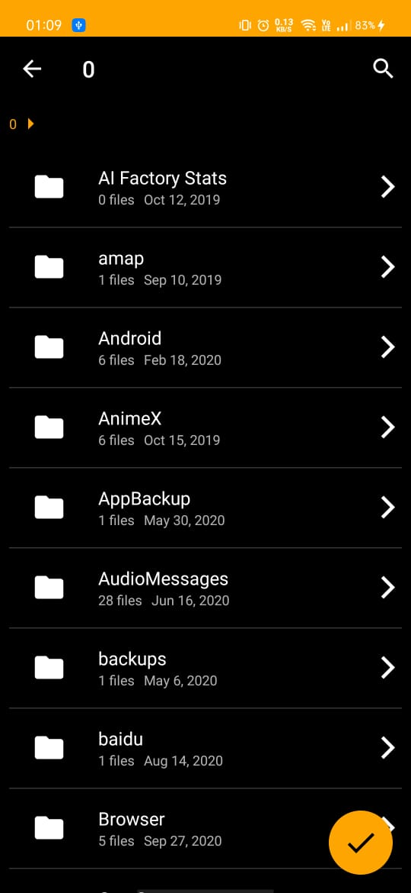
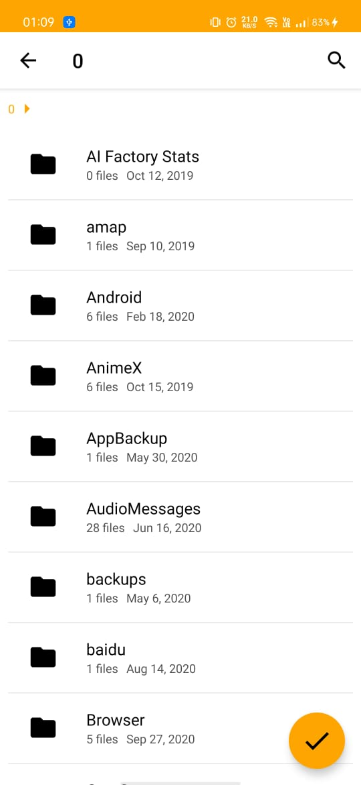
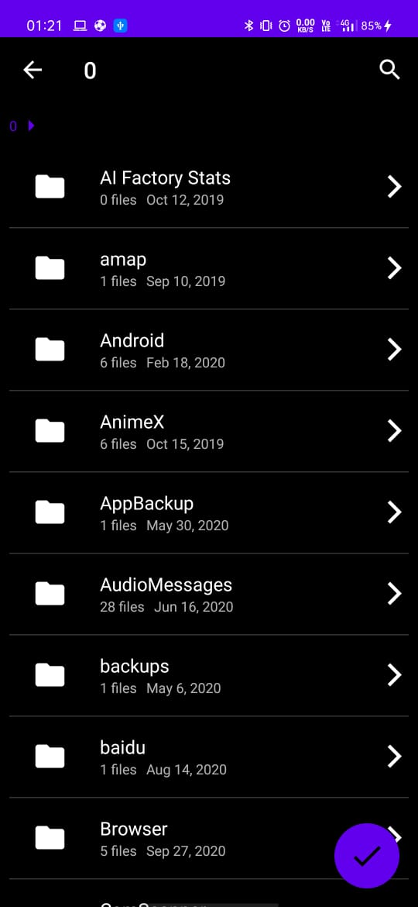

# App-Java-FileManager


App-Java-FileManager is a library designed to package a powerful file selector for android. You can:
 - Start the file picker activity from any activity or fragment
 - Select single or multiple files
 - Use as a Directory Picker
 - Filter out files you want to display
 - Add custom theme or use default theme options (Light & Dracula)
 - And much more which you have to try out for yourself


| Unicorn Dracula                    | Unicorn Default                     | Custom Theme                     |
|:----------------------------------:|:-----------------------------------:|:--------------------------------:|
|  |     | |


## Download
Gradle:

```groovy
repositories {
    maven { url ‘https://jitpack.io’ }
}

dependencies {
    implementation 'com.github.pawanshukla0963:App-Java-FileManager:$latest_version'
}
```

## How do I use Unicorn File Picker?
#### Permission
The library requires two permissions:
- `android.permission.READ_EXTERNAL_STORAGE`
- `android.permission.WRITE_EXTERNAL_STORAGE`

If you are targeting Android 6.0+, you need to handle runtime permission request before next step.

Also, don't forget to add ``` requestlegacyexternalstorage=true ``` for Android 10.


#### Simple usage snippet
------
Start `UnicornFilePicker` from current `Activity` or `Fragment`:

```java
UnicornFilePicker.from(MainActivity.this)
                    .addConfigBuilder()
                    .selectMultipleFiles(false)
                    .showOnlyDirectory(true)
                    .setRootDirectory(Environment.getExternalStorageDirectory().getAbsolutePath())
                    .showHiddenFiles(false)
                    .setFilters(new String[]{"pdf", "png", "jpg", "jpeg"})
                    .addItemDivider(true)
                    .theme(R.style.UnicornFilePicker_Dracula)
                    .build()
                    .forResult(Constants.REQ_UNICORN_FILE);
```


#### Themes
There are two built-in themes you can use to start `UnicornFilePicker`:
- `R.style.UnicornFilePicker_Default` (light mode)
- `R.style.UnicornFilePicker_Dracula` (dark mode)  

You can also define your own custom theme.


#### Receive Result
In `onActivityResult()` callback of the starting `Activity` or `Fragment`:

```java
List<String> mSelected_files;

@Override
protected void onActivityResult(int requestCode, int resultCode, Intent data) {
    super.onActivityResult(requestCode, resultCode, data);
    if (requestCode == REQUEST_CODE_CHOOSE && resultCode == RESULT_OK) {
        ArrayList<String> files = data.getStringArrayListExtra("filePaths");
        for(String file : files){
            Log.e(TAG, file);
        }
    }
}
```

---

## **PLEASE NOTE:**
### API >= 21 && API <=28
The file picker works great on legacy android versions and there's is no need for any additional configuration.

### API 29
You need to add the following line to your manifest file if you want to use this picker on android 10 for atleast a few months.
```
    android:requestLegacyExternalStorage="true"
```

This line indicates to the operating system that we want to opt out of the new Scoped Storage system.

### API > 29 (WIP)
Unfortunately this library has no stable support for file access on Android 11+. 
Behaviour noticed on Android 11 -> While the file picker works, the only files that are displayed are the media files which include images, videos, audio, etc. 
This is because of the introduction of the Google's infamous new storage model called Scoped Storage which aims to improve file security. You can read all about this here: [Scoped Storage](https://developer.android.com/about/versions/11/privacy/storage)

This feature is currently a work-in-progress along with many other awesome things on the roadmap. 
If you feel you can add value to this feature then please see the section on Contributing.

---


